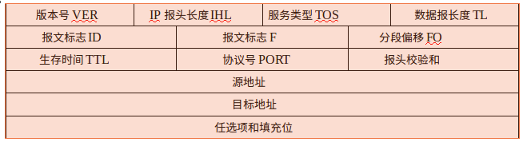

# C语言实现ping命令

## Ping命令介绍

**Ping** (Packet Internet Groper)，因特网包探索器，用于测试网络连接量的程序。Ping发送一个`ICMP`(Internet Control Messages Protocol）即**因特网信报控制协议**；  
回声请求消息给目的地并报告是否收到所希望的ICMP echo （ICMP回声应答）。它是用来检查网络是否通畅或者网络连接速度的命令  
ping命令通常用来作为网络可用性的检查。ping命令可以对一个网络地址发送测试数据包，看该网络地址是否有响应并统计响应时间，以此测试网络

## 原理

### ICMP

向指定的网络地址发送一定长度的数据包，按照约定，若指定网络地址存在的话，会返回同样大小的数据包，当然，若在**特定时间(TTL)**内没有返回，就是“超时”，会被认为指定的**网络地址不存在**.  
ICMP协议通过IP协议发送的，IP协议是一种**无连接的，不可靠的数据包**协议。在Unix/Linux,序号从0开始计数，依次递增.  
Ping命令只使用众多ICMP报文中的两种："请求回送'(ICMP_ECHO)和"请求回应'(ICMP_ECHOREPLY)。这两种报文类型的**报头格式**如下:  

1. 当TYPE字段为`ICMP_ECHO`，CODE字段为0时，代表**请求回送报文**；  
2. TYPE字段为`ICMP_ECHOREPLY`，CODE字段为0时，代表**请求回应报文**
3. 校验和算法:这一算法称为网际校验和算法，把被校验的数据１６位进行累加，然后取反码，若数据字节长度为奇数，则数据尾部补一个字节的０以凑成偶数,为上述ICMP数据结构的`icmp_cksum`变量。
4. 标识符：用于唯一标识ICMP报文, 为上述ICMP数据结构的`icmp_id`宏所指的变量
5. 顺序号:代表ICMP报文的发送顺序，为上述ICMP数据结构的`icmp_seq`宏所指的变量。

ICMP的数据结构可以在头文件`<netinet/ip_icmp.h>`中找到

ICMP报头为８字节,数据报长度最大为64K字节.

ICMP封装好后如下图:  

### IP

ICMP协议是IP子层的一个协议,但是由于Ping命令在发送数据包的途中会经过不同的子网，因此牵涉到路由选择等问题，所以ICMP报文需通过IP协议来发送.ICMP数据报的数据发送前需要两级封装：首先添加`ICMP报头`形成ICMP报文，再添加`IP报头`形成IP数据报。因此我们还需知道IP报文的格式

### IP的分组格式

**整个ICMP报文作为了IP报文的数据部分**

IP报头格式数据结构在头文件`<netinet/ip.h>`里,下面对ping命令用到的IP报文字段进行解释  
其中ping程序只使用以下数据：

1. **IP报头长度IHL（Internet Header Length）**:以４字节为一个单位来记录IP报头的长度，是上述IP数据结构的`ip_hl`变量。
2. **生存时间TTL（Time To Live）**:以秒为单位，指出IP数据报能在网络上停留的最长时间，其值由**发送方**设定，并在经过路由的每一个节点时减一，当该值为０时，数据报将被丢弃，是上述IP数据结构的`ip_ttl`变量。
